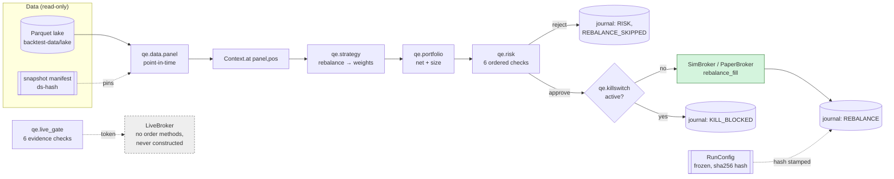
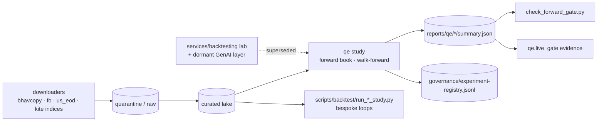

# QuantEmbrace — Current-State Diagrams

> Companion to [current-state.md](current-state.md). Snapshot at commit `d8ca741` (2026-09-25).
> Red nodes can reach a real broker venue. Green nodes are simulation-only by construction.

## 1. v2 `qe` engine (primary) — no venue reachable



`execute_rebalance` (`qe/engine/core.py`) is the only path to a fill. Sim (`kill=None`) and paper (`PaperBroker` plus the kill switch) both call it, which is why paper == sim holds to ₹0.00.

## 2. v1 Kafka stack (frozen) — broker reachability

```mermaid
flowchart LR
    WS[Kite / Alpaca WS] --> DI[data_ingestion]
    DI -->|ticks.*| SE[strategy_engine<br/>StrategyRunner stamps paper_trade]
    DI -->|candle-cache| SE
    SE -->|signals.pending| AI[ai_engine<br/>HMM/GBT stubs]
    AI -->|signals.enriched| RE[risk_engine<br/>11 validators]
    SE -.fallback.-> RE
    RE -->|signals.approved| EE[execution_engine]
    EE -->|paper_trade=True| PS[PaperSimulator]:::sim
    EE -->|paper_trade=False<br/>(also when field missing: F-1)| EAS[execute_approved_signal<br/>kill · universe* · risk_decision_id]
    EAS --> FUN[_place_order_with_broker_idempotency<br/>kill · rate limit only]
    FUN --> ZB[ZerodhaBrokerClient.place_order]:::venue
    FUN --> AB[AlpacaBroker.submit_order]:::venue
    PROT[protective stop / emergency flatten /<br/>pending protective] --> FUN
    MIS[MIS square-off<br/>paper flag only] --> ZB
    EXR[exit_order_router<br/>LIVE+live_enabled: unreachable F-3] -.-> ZB
    CLI[scripts/strategy/config.py go-live<br/>flips paper_trade in DynamoDB] -.-> SE
    classDef sim fill:#d4f4dd,stroke:#2e7d32
    classDef venue fill:#ffd6d6,stroke:#c62828
```

`*` The universe validator is skipped when it is `None` (paper build failure, F-6). Non-NSE markets bypass it in every mode (F-2).

## 3. Research plane


