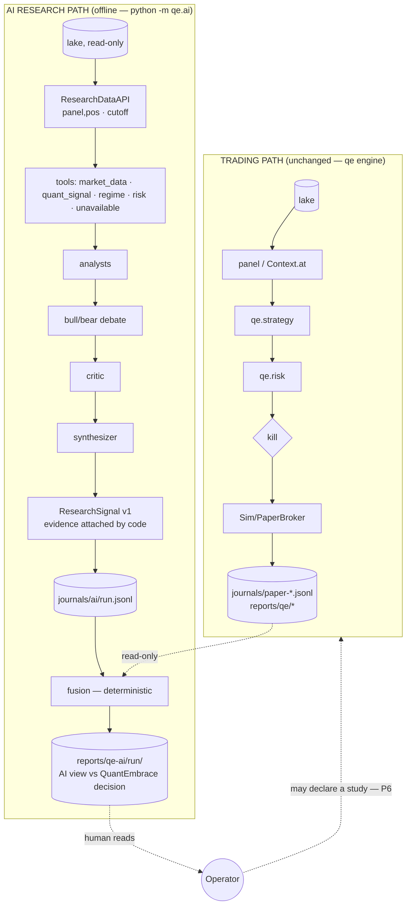

# Hybrid AI Research — Data Flow

> ADR-043. Flows for `qe.ai` alongside the unchanged engine. Components are `[PLANNED — not yet implemented]` until their phase lands (see [hybrid-ai-system.md §6](hybrid-ai-system.md)).

## 1. Two separate paths

There is no arrow from RESEARCH into TRADING except through a human. P6 `[PLANNED]` will let the operator turn a hypothesis into a declared `qe study`, but promotion into the engine still requires the existing gates and human approval.

## 2. Research run sequence

1. **Configuration.** `python -m qe.ai research --config configs/qe_ai_research.yaml --as-of D` loads `ResearchRunConfig` (hashed with `exclude_none`) and the referenced book config (read-only).
2. **Data.** `resolve_panel_files` → `create_snapshot` (pins `ds-…`) → `load_panel([D−2y, D], tz=market_tz)`. `pos` = the last row ≤ D. INDIAVIX comes from `OhlcvLake.load_bars(segment="INDICES")` when it covers D; otherwise that evidence is UNAVAILABLE and never forward-filled.
3. **Cutoff.** `information_cutoff = panel.date_at(pos) @ market_close_time(market)` in the market's timezone.
4. **Journal header.**
   - `SESSION_START` carries `run_id`, `mode="ai-research"`, the config hash, the config echo, `code_sha` and the snapshot ID.
   - A `RUN_MANIFEST` event follows with as-of, cutoff, book-config hash, symbols, research mode, model IDs and knowledge cutoffs, prompt versions and hashes, budget and seed.
5. **Market-level research.**
   - The regime tool returns `RegimeReading`.
   - The regime analyst runs, logging `TOOL_CALL`, `LLM_CALL` and `AGENT_OBSERVATION`.
6. **Per-symbol research.**
   - Tools run and each call is journaled as `TOOL_CALL`.
   - Analysts run, then debate rounds, then the critic, then the synthesizer.
   - Each LLM call is journaled as `LLM_CALL` with model, prompt version and hash, latency, tokens, status, error and whether it was served from cache.
   - Each agent result is journaled as `AGENT_OBSERVATION`.
7. **Signal.** Code builds and validates the `ResearchSignal` (point-in-time, status/score consistency, contamination) and journals it as `RESEARCH_SIGNAL`. A failure is journaled as `SYMBOL_FAILED` with a sanitized error, and the run continues.
8. **Close.** `SESSION_END` records counts, tokens and failures. An abort writes a sanitized `SESSION_ABORT`.
9. **Report.** `python -m qe.ai report --journal …` rebuilds `reports/qe-ai/<run_id>/signals.jsonl` and `summary.md` from the journal.
10. **Fusion.** `python -m qe.ai fuse --research … [--engine-journal …] [--context shadow|study]`:
    - recomputes the quant view deterministically (factor rank, the engine's pick, hard flags);
    - fuses it with the signals per `configs/research_fusion.yaml`;
    - optionally annotates with the engine journal's RISK and REBALANCE records for that date (read-only);
    - writes `fusion.jsonl` and `fusion.md`.

## 3. Record provenance (every stored record)

| Field | Source |
|---|---|
| `timestamp` | Journal `ts` (UTC, µs) plus domain timestamps (`decision_ts`, `information_cutoff`, `knowledge_ts`) |
| `version` / `schema_version` | `research_signal/1`, `qe_ai_research/1`, `qe_ai_fusion/1` |
| `trace_id` | A per-symbol UUID within a run. `research_id = run_id` |
| `source` | Tool name, or `agent_id` plus `model_id` |
| `model` | `model_id` plus `knowledge_cutoff` from `ModelProfile` |
| config / code / data | Config hash, `code_sha`, `data_snapshot_id` in `SESSION_START` |

## 4. Failure flow

| Failure | Result |
|---|---|
| LLM timeout or error after retries | Component TIMEOUT/ERROR, score None |
| Malformed JSON after retry | Component MALFORMED, score None |
| Forbidden content in output | Component BLOCKED, text dropped |
| Budget exhausted / breaker open | The remaining components are UNAVAILABLE |
| Point-in-time violation (evidence after cutoff) | The signal is rejected (fail-closed), journaled as `SYMBOL_FAILED` |
| No data source (fundamentals, news, sentiment) | UNAVAILABLE, zero LLM calls |
| No signal, or all components unavailable | Fusion uses the quant-only path; the AI recommendation is `UNAVAILABLE` |

In every case the trading path is unaffected, because it does not depend on `qe.ai`.
