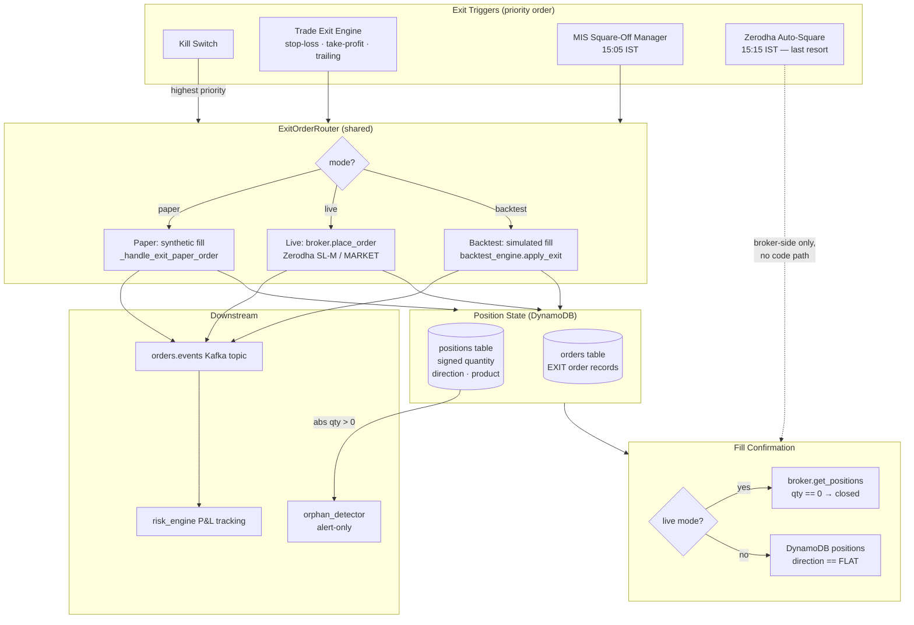

# Hybrid Trade Exit & MIS Square-Off Architecture

**Status:** PHASE 3 COMPLETE  
**Author:** Chief Architect  
**Date:** 2026-05-25  
**Version:** 3.0 — Phase 1 (MIS bug fix), Phase 2 (TEE + ExitOrderRouter), Phase 3 (trailing stop + startup reconciliation + MIS/TEE integration tests) complete  

---

## 1. Architecture Diagram



---

## 2. Responsibility Split

| Component | Owns | Does NOT own |
|---|---|---|
| **Trade Exit Engine (TEE)** | Stop-loss triggers, take-profit triggers, trailing stop updates, continuous position price monitoring | Order placement mechanics, broker API calls, P&L calculation |
| **ExitOrderRouter** | Mode dispatch (paper / live / backtest), idempotency enforcement, DynamoDB write, `orders.events` publish | Deciding *when* to exit, broker authentication |
| **MIS Square-Off Manager** | 15:05 IST time trigger, fill confirmation loop, deadline escalation | Intraday P&L management, stop-loss logic |
| **KillSwitch** | System-wide halt signal, immediate flatten trigger | Position monitoring, order routing |
| **OrphanDetector** | Alerting on unprotected open positions | Auto-flattening (ADR-015 §5.4 — forbidden) |
| **Zerodha 15:15 auto-square** | Absolute last-resort broker fallback | Everything else — this is a broker guarantee, not a code path |
| **risk_engine** | P&L recording from `orders.events`, daily loss limits | Exit decision logic, order placement |
| **strategy_engine** | Signal generation, daily cap enforcement | Exit management — exits bypass the strategy→risk signal flow entirely |

**Key invariant:** Exit orders are placed by the execution engine directly (TEE → ExitOrderRouter → broker/paper). They do **not** travel through `signals.pending` → `signals.approved`. The risk engine sees exits only via `orders.events` for P&L accounting, not for approval.

---

## 3. Trade Lifecycle State Machine

```
                    ┌─────────────────────────────────────────────┐
                    │                   FLAT                      │
                    │         quantity = 0, direction = FLAT      │
                    └──────────────────┬──────────────────────────┘
                                       │ entry signal approved
                                       ▼
                    ┌─────────────────────────────────────────────┐
                    │              ENTRY_PENDING                  │
                    │  order submitted, awaiting broker fill      │
                    └──────┬───────────────────────┬─────────────┘
                            │ fill confirmed        │ rejected / timeout
                            ▼                       ▼
          ┌─────────────────────────────┐        FLAT
          │            OPEN             │
          │  abs(quantity) > 0          │◄─── partial fill reduces qty
          │  direction = LONG or SHORT  │         but stays OPEN
          └──────────────┬──────────────┘
                          │ exit trigger fires
                          │ (stop / tp / mis / kill)
                          ▼
          ┌─────────────────────────────┐
          │          EXIT_PENDING       │
          │  exit order submitted       │
          │  idempotency lock held      │
          └──────────────┬──────────────┘
                          │ exit fill confirmed
                    ┌─────┴──────┐
                    │            │
                    ▼            ▼
                  FLAT      OPEN (partial exit — remaining qty open)
```

**Forbidden transitions:**
- OPEN → OPEN with direction reversal (quantity crosses zero) — risk engine rejects the entry signal
- EXIT_PENDING → EXIT_PENDING — duplicate exit order, idempotency key blocks it
- Any state → ENTRY_PENDING when daily cap is reached — cap blocks new entries only, not exits

---

## 4. Signed Quantity Rules

This is the canonical invariant for all position records in the `positions` DynamoDB table.

| Condition | Meaning | `direction` field |
|---|---|---|
| `quantity > 0` | Long position (net long exposure) | `"LONG"` |
| `quantity < 0` | Short position (net short exposure) | `"SHORT"` |
| `quantity == 0` | Flat — no open exposure | `"FLAT"` |
| `abs(quantity) > 0` | Open exposure — **either** direction | `"LONG"` or `"SHORT"` |

**Arithmetic rules (applied by `apply_fill_to_position`):**

```
BUY fill:   new_qty = old_qty + filled_qty   (always positive delta)
SELL fill:  new_qty = old_qty - filled_qty   (always negative delta)
```

**Examples:**

| Scenario | old_qty | fill | new_qty | direction |
|---|---|---|---|---|
| Open long | 0 | BUY 100 | +100 | LONG |
| Add to long | +100 | BUY 50 | +150 | LONG |
| Close long | +100 | SELL 100 | 0 | FLAT |
| Open short (paper) | 0 | SELL 78 | -78 | SHORT |
| Close short | -78 | BUY 78 | 0 | FLAT |
| Partial close long | +100 | SELL 40 | +60 | LONG |

**Implications for MIS filter (current bug and fix):**

```python
# CURRENT (BUG) — misses shorts stored as negative quantity
FilterExpression="product = :mis AND quantity > :zero"

# FIXED — uses direction field which is always correctly set
FilterExpression="product = :mis AND direction <> :flat"
ExpressionAttributeValues={
    ":mis":  {"S": "MIS"},
    ":flat": {"S": "FLAT"},
}
```

The `direction` field is the canonical open/closed signal. `quantity != 0` is the arithmetic invariant; `direction != "FLAT"` is the readable index. Both must be consistent; `direction` is preferred for queries.

---

## 5. Exit Policy Rules

Rules are evaluated in priority order. The first matching rule fires the exit; lower-priority rules are skipped.

| Priority | Rule | Trigger condition | Order type |
|---|---|---|---|
| 1 | **Kill switch** | `kill_switch.active == True` | MARKET (immediate flatten all) |
| 2 | **Stop-loss** | LONG: `last_price ≤ stop_price`; SHORT: `last_price ≥ stop_price` | MARKET (SL-M on Zerodha) |
| 3 | **Take-profit** | LONG: `last_price ≥ take_profit`; SHORT: `last_price ≤ take_profit` | LIMIT at take_profit ± slippage |
| 4 | **Trailing stop** | Stop price updated as price moves favorably; fires on adverse cross (same as stop-loss rule 2) | MARKET |
| 5 | **MIS time exit** | Clock reaches `MIS_CLOSE_TIME_IST` (default 15:05) | MARKET |
| 6 | **Zerodha auto-square** | 15:15 IST — broker-side only | N/A (not a code path) |

**Rule application per mode:**

| Mode | Stop-loss source | Price source | Exit mechanic |
|---|---|---|---|
| **Live** | `stop_price` from position record (set at fill) | Zerodha WebSocket tick | Broker SL-M order placed immediately at fill, monitored by `bulk_order_poller` |
| **Paper** | Same `stop_price` from position record | Candle close price from candle-cache | TEE polls candle-cache every minute, synthetic exit fill via `_handle_exit_paper_order` |
| **Backtest** | Same field | Historical candle OHLC | Vectorized check: if candle LOW ≤ stop → exit at stop price; if candle HIGH ≥ tp → exit at tp |

**Take-profit order handling:**
- Live: LIMIT order at `take_profit` price placed at entry fill time (OCO with stop-loss)
- Paper: TEE checks take-profit level on each candle close; synthetic fill at take_profit price
- If both stop and take-profit are hit within the same candle: stop-loss takes precedence (conservative)

---

## 6. MIS Square-Off Flow

```
15:04:30 IST
  MISSquareOffManager.run() wakes (1 minute pre-fire log)
  logs mis_square_off.scheduled

15:05:00 IST
  _execute_mis_square_off() fires
    ↓
  _get_open_mis_positions()
    DynamoDB scan: product = "MIS" AND direction <> "FLAT"   ← fixed filter
    Returns [{symbol, direction, quantity (signed), avg_entry_price}]
    ↓
  For each position:
    LONG (qty > 0) → place MARKET SELL qty=abs(quantity)
    SHORT (qty < 0) → place MARKET BUY  qty=abs(quantity)
    Paper mode → ExitOrderRouter → synthetic fill
    Live mode  → ExitOrderRouter → zerodha.place_order
    ↓
  _await_fills_or_escalate(close_order_ids, original_positions)
    Poll every MIS_CONFIRM_INTERVAL (default 10s)
    Confirmation source:
      Live:  zerodha.get_positions() — broker qty == 0
      Paper: DynamoDB positions — direction == "FLAT"
    ↓
  15:10:00 IST DEADLINE
    All closed? → log mis_square_off.all_positions_closed — done
    Any open?  → ESCALATE:
                   kill_switch.activate(reason="mis_positions_not_closed")
                   SNS CRITICAL alert with unclosed symbols
                   Log CRITICAL mis_square_off.positions_not_closed_at_deadline

15:15:00 IST
  Zerodha auto-squares any remaining positions (broker-side, no code path)
  Risk: unknown slippage, no fill records in our system
```

**Paper mode confirmation difference:**
In paper mode there is no broker to confirm. After `_handle_exit_paper_order` writes the synthetic fill and updates `positions.direction = "FLAT"`, confirmation is immediate (the position record is the source of truth). The polling loop checks DynamoDB `direction == "FLAT"` rather than the broker.

---

## 7. Risk Cap Behavior

The strategy daily cap (`max_signals_per_day` per strategy) exists to limit **entry signal generation**. Exit management must be immune to cap state.

**Current cap implementation (strategy_engine):**
```
strategy_runner.daily_cap_reached strategy=X cap=10 signals_today=10
```
The runner suppresses `publish_signal()` calls once the cap is hit. This is correct for entries.

**Required invariant:**
The `signals_today` counter must be incremented **only for entry signals**, never for:
- MIS square-off orders
- TEE stop-loss / take-profit exits
- Kill switch flatten orders
- Reconciliation close orders

**Enforcement mechanism:**
Exit orders are placed directly by the execution engine (TEE / MIS Manager → ExitOrderRouter), never via the strategy → risk → execution Kafka signal path. They are therefore never counted against `signals_today`. No code change to the cap counter is required — the architectural separation enforces this automatically.

**What the cap does and does not block:**

| Action | Blocked by cap? |
|---|---|
| New entry signal published by strategy | Yes — if `signals_today >= cap` |
| Stop-loss exit triggered by TEE | No |
| Take-profit exit triggered by TEE | No |
| MIS square-off at 15:05 | No |
| Kill switch flatten | No |
| Trailing stop update | No |

---

## 8. Duplicate Order Prevention

### Entry orders (existing)
Idempotency key: `signal_id` — `order_manager.get_order_by_signal()` blocks duplicate processing. Already implemented.

### Exit orders (new — TEE)

**Idempotency key structure:**
```
EXIT-{symbol}-{market}-{trigger_type}-{session_date_ist}
```

Examples:
```
EXIT-MARUTI-NSE-STOP_LOSS-2026-05-25
EXIT-NHPC-NSE-TAKE_PROFIT-2026-05-25
EXIT-ICICIBANK-NSE-MIS_CLOSE-2026-05-25
EXIT-ALL-NSE-KILL_SWITCH-2026-05-25
```

**DynamoDB enforcement:**
The `positions` table holds an `exit_order_id` field (null when OPEN). ExitOrderRouter performs a conditional update:

```
ConditionExpression: "attribute_not_exists(exit_order_id) AND direction <> :flat"
UpdateExpression: "SET exit_order_id = :exit_id, status = :pending"
```

If the condition fails (already has an `exit_order_id`), the router skips placement — the exit is already in-flight. This prevents TEE and MIS from both firing exits for the same position.

**Priority override for kill switch:**
Kill switch exits use an unconditional write — they replace any in-flight exit_order_id. The kill switch takes priority regardless of what exit is pending.

```
ConditionExpression: "direction <> :flat"   (no exit_order_id check)
```

---

## 9. Reconciliation Design

Reconciliation runs in two contexts:

### 9.1 Startup Reconciliation

On `ExecutionService.start()`, before consuming from `signals.approved`:

```
1. Fetch DynamoDB positions where direction != "FLAT"
2. Fetch broker positions (zerodha.get_positions() / alpaca.get_positions())
3. For each DynamoDB position with abs(qty) > 0:
   a. If position exists in broker with matching qty → OK, continue monitoring
   b. If not in broker (qty=0 at broker) → position was closed externally
      → Write synthetic exit fill, set direction=FLAT in DynamoDB
      → Publish synthetic ORDER_FILLED to orders.events for P&L recording
      → Log execution_service.startup_reconciliation_external_close
4. For each broker position not in DynamoDB:
   → Create DynamoDB record (orphan recovery)
   → Log CRITICAL execution_service.startup_reconciliation_unknown_broker_position
5. Log reconciliation summary: opened/closed/unknown counts
```

Startup reconciliation is **live mode only**. In paper mode, DynamoDB is authoritative — no broker to reconcile against. In backtest, reconciliation is not applicable.

### 9.2 Pre-MIS Reconciliation

At `MIS_CLOSE_TIME_IST - 5 minutes` (default 15:00 IST), before MIS square-off fires:

```
1. Re-run position snapshot (DynamoDB vs broker)
2. Resolve any discrepancies found
3. Build the canonical position list for MIS square-off from the reconciled state
4. Log pre_mis_reconciliation.complete with position_count
```

This ensures MIS square-off operates on a clean, verified position list and is not confused by any position that was externally closed (e.g., via operator Kite intervention).

---

## 10. Metrics and Alerts

### Metrics (CloudWatch / Prometheus)

| Metric | Type | Labels | Trigger |
|---|---|---|---|
| `trade_exit.triggered` | Counter | `trigger_type`, `mode`, `symbol` | Each exit trigger fires |
| `trade_exit.fill_confirmed_latency_ms` | Histogram | `mode`, `trigger_type` | Time from exit order to fill confirmation |
| `trade_exit.slippage_bps` | Histogram | `mode`, `trigger_type`, `symbol` | `(exit_price - stop_price) / stop_price * 10000` |
| `mis_square_off.positions_found` | Gauge | `mode` | At 15:05 scan |
| `mis_square_off.positions_closed` | Counter | `mode` | Each confirmed close |
| `mis_square_off.positions_unclosed_at_deadline` | Counter | — | CRITICAL: any unclosed at 15:10 |
| `orphan_detector.orphans_found` | Gauge | — | Each detector cycle |
| `position.open_count` | Gauge | `direction`, `market` | Updated on every fill |
| `position.open_notional` | Gauge | `market` | Updated on every fill |
| `tee.price_check_latency_ms` | Histogram | `mode` | Each TEE polling cycle |

### Alerts

| Condition | Severity | Channel | Action required |
|---|---|---|---|
| `mis_square_off.positions_unclosed_at_deadline > 0` | CRITICAL | SNS → PagerDuty | Immediate operator review; Zerodha 15:15 is fallback |
| `trade_exit.triggered{trigger_type=STOP_LOSS}` | WARNING | Slack | No action required, informational |
| `position.open_count > 0` at 15:16 IST | CRITICAL | SNS | Position not closed by broker auto-square |
| `startup_reconciliation_unknown_broker_position` | CRITICAL | SNS | Unknown exposure; investigate before trading |
| `orphan_detector.orphans_found > 0` | CRITICAL | Log only (paper), SNS (live) | Paper: expected; live: requires investigation |
| Kill switch activated by MIS manager | CRITICAL | SNS | Operator must review and deactivate |

---

## 11. Failure Modes

### F-1: TEE crashes mid-session

**Scenario:** Trade Exit Engine process dies at 11:30 IST. Stop-loss orders are never checked.  
**Impact:** Positions are unmonitored for the remainder of the session.  
**Mitigation:**
- Live mode: broker-held SL-M orders (placed at fill time) execute automatically at Zerodha. TEE crash does not affect live stop protection.
- Paper mode: no live broker stops. Positions run unprotected until 15:05.
- MIS at 15:05 closes all remaining positions regardless.
- Zerodha 15:15 is absolute fallback.

**Recovery:** TEE restarts pick up all open positions from DynamoDB and resume monitoring.

### F-2: MIS square-off fails to read positions

**Scenario:** DynamoDB unavailable at 15:05.  
**Impact:** MIS cannot determine what to close.  
**Mitigation:** `_execute_mis_square_off` catches the exception, sends CRITICAL SNS alert. Zerodha 15:15 auto-squares. The alert triggers operator action; the broker fallback prevents uncontrolled exposure.

### F-3: Broker connection lost during square-off

**Scenario:** Zerodha WebSocket / REST connection drops at 15:05.  
**Impact:** Close orders cannot be placed.  
**Mitigation:** `_place_mis_close_order` catches the exception per position, logs `mis_square_off.close_order_failed`, and continues to the next position. `_await_fills_or_escalate` will see no fills at 15:10 and activate kill switch. Zerodha 15:15 auto-squares.

### F-4: Stop-loss gap (price jumps past stop)

**Scenario:** MARUTI stop_price=13100 but opens at 12900 the next candle. Stop-loss check fires but market order fills at 12900.  
**Impact:** Slippage larger than expected.  
**Mitigation:** This is unavoidable market risk. Track `trade_exit.slippage_bps` metric. For paper mode, the synthetic fill simulates the candle's open price, not the stop price. For live, Zerodha fills at best available. Both are correct behaviours for SL-M orders.

### F-5: Duplicate exit orders (race between TEE and MIS)

**Scenario:** TEE fires a stop-loss exit at 15:04 for MARUTI. MIS fires at 15:05 for the same MARUTI position before the TEE exit is confirmed.  
**Impact:** Two exit orders for the same position.  
**Mitigation:** Idempotency key + conditional DynamoDB write. MIS reads `exit_order_id` not null → skips placement. The first exit wins; subsequent exits are silently dropped.

### F-6: Kill switch activated while exits are in-flight

**Scenario:** Kill switch fires at 15:04 while MIS is already running.  
**Impact:** Both paths try to exit the same positions.  
**Mitigation:** Kill switch uses unconditional write (overrides `exit_order_id`). Kill switch exits are priority-1. MIS falls through — positions are already closing via kill switch path. Confirm via DynamoDB direction check.

### F-7: Paper position stored with negative qty (current bug in MIS)

**Scenario:** Paper SELL fills create `quantity = -78` in DynamoDB. MIS filter `quantity > 0` misses short paper positions.  
**Impact:** Short paper positions are not closed at 15:05 in paper mode. They remain as open DynamoDB records past market close.  
**Mitigation:** Fix the filter to use `direction <> "FLAT"` (Phase 1, immediate). This is already identified and scoped.

---

## 12. Test Plan

### 12.1 Unit Tests

| Test | Location | Validates |
|---|---|---|
| `test_signed_quantity_long_open` | `tests/unit/execution/test_order_manager.py` | BUY fill sets qty=+N, direction=LONG |
| `test_signed_quantity_short_open` | same | SELL on flat sets qty=-N, direction=SHORT |
| `test_signed_quantity_close_short` | same | BUY on short (qty=-N) → qty=0, direction=FLAT |
| `test_signed_quantity_partial_close` | same | SELL partial on long → qty reduced, direction=LONG |
| `test_mis_filter_includes_shorts` | `tests/unit/execution/test_mis_square_off.py` | `direction <> "FLAT"` returns both LONG and SHORT positions |
| `test_mis_filter_excludes_flat` | same | FLAT positions not returned |
| `test_exit_idempotency_stop_loss` | `tests/unit/execution/test_exit_router.py` | Second stop-loss exit for same position is silently dropped |
| `test_exit_kill_switch_overrides_pending` | same | Kill switch replaces in-flight stop exit |
| `test_cap_does_not_block_exits` | `tests/unit/strategy/test_strategy_runner.py` | Exit orders not counted against `signals_today` |
| `test_stop_loss_long` | `tests/unit/execution/test_tee.py` | LONG: exit fires when last_price ≤ stop_price |
| `test_stop_loss_short` | same | SHORT: exit fires when last_price ≥ stop_price |
| `test_take_profit_long` | same | LONG: exit fires when last_price ≥ take_profit |
| `test_take_profit_prefers_stop_on_same_candle` | same | Stop wins over TP on same candle |

### 12.2 Integration Tests (LocalStack)

| Test | Validates |
|---|---|
| `test_paper_stop_loss_end_to_end` | Signal → fill → TEE stop trigger → synthetic exit → direction=FLAT in DynamoDB |
| `test_paper_mis_closes_longs_and_shorts` | Short + long positions both closed at 15:05 trigger |
| `test_paper_mis_idempotency` | MIS triggered twice: second run finds direction=FLAT, no duplicate orders |
| `test_startup_reconciliation_external_close` | Position in DynamoDB but not broker → synthetic exit written |
| `test_startup_reconciliation_unknown_broker` | Position at broker but not DynamoDB → DynamoDB record created |

### 12.3 Paper Trading Acceptance Criteria (Day 5)

Before any live capital is deployed, the following must be observed in a real paper session:

- [ ] At 15:05 IST: `mis_square_off.starting` log fires exactly once
- [ ] `mis_square_off.positions_found` count matches actual open position count (both LONG and SHORT)
- [ ] All positions show `direction = "FLAT"` in DynamoDB within 60 seconds of 15:05
- [ ] `mis_square_off.all_positions_closed` logged (not the deadline escalation path)
- [ ] No duplicate exit orders in the orders table
- [ ] `orders.events` contains exit fill events for every position
- [ ] risk_engine logs `handle_fill.pnl_recorded` for each exit fill
- [ ] `orphan_detector.cycle_summary` shows `orphans_found = 0` after 15:06

---

## 14. Phase 2 Design Detail — Trade Exit Engine & ExitOrderRouter

### 14.1 Why Exits Bypass the Signal Pipeline

Every entry signal flows: `strategy_engine → signals.pending → risk_engine → signals.approved → execution_engine`.

Exit orders **must not** flow through this path. Reasons:

| Concern | Explanation |
|---|---|
| **Daily cap** | `signals_today` is incremented in `strategy_engine.publish_signal()`. Exit orders never call `publish_signal()` — they are execution-layer decisions, not strategy decisions. The cap is never reached by exits. |
| **Latency** | Routing through two Kafka topics (pending → approved) adds 50–200 ms round-trip. For stop-loss exits near circuit limits, this is unacceptable. |
| **Coupling** | Exit logic belongs to the execution layer. Routing through `risk_engine` would require the risk engine to understand exit semantics, breaking layer separation. |
| **Cap must block entries only** | If the cap is at 10/10, existing positions must still be managed and closed. Routing exits through the cap mechanism would block their own protection. |

**Enforcement:** `TradeExitEngine` and `MISSquareOffManager` call `ExitOrderRouter.route()` directly. The Kafka `signals.pending` and `signals.approved` topics are never touched. `signals_today` is never touched.

### 14.2 Trade Exit Engine — Responsibilities

`services/execution_engine/monitors/trade_exit_engine.py`

**Owns:**
- Polling DynamoDB positions every `TEE_POLL_INTERVAL_SECONDS` (default 60s, paper mode).
- Side-aware stop-loss evaluation: LONG fires when `last_price ≤ stop_price`; SHORT fires when `last_price ≥ stop_price`.
- Side-aware take-profit evaluation: LONG fires when `last_price ≥ take_profit`; SHORT fires when `last_price ≤ take_profit`.
- Alerting (CRITICAL log) on positions that are OPEN but have no exit policy attached (`stop_price` absent).
- Calling `ExitOrderRouter.route()` when a trigger condition is met.

**Does NOT own:**
- Order placement mechanics (ExitOrderRouter's job).
- Price sourcing beyond reading the prices table / position last_price.
- Trailing stop updates (Phase 3).
- Breakeven and partial profit triggers (Phase 3).
- Strategy signal generation or risk decisions.

### 14.3 ExitOrderRouter — Responsibilities

`services/execution_engine/exit/exit_order_router.py`

**Owns:**
- Mode dispatch: PAPER → synthetic fill; LIVE → broker.place_order (Phase 4 gate); BACKTEST → simulated.
- Idempotency enforcement: conditional DynamoDB write on `exit_order_id` field.
- Live mode safety gate: requires `live_trading_enabled=True` AND explicit configuration. Blocked by default.

**Does NOT own:**
- Deciding when to exit (TEE's job).
- Strategy daily cap state (never touches it).
- Broker authentication.

### 14.4 Exact Event Flow

```
Entry fill confirmed
    │
    ▼
order_manager.apply_fill_to_position()     ← writes qty, direction, avg_price to DynamoDB
    │
    ▼
order_manager.attach_exit_policy()         ← writes stop_price, take_profit, exit_state=EXIT_POLICY_ATTACHED
    │
    ▼
[60-second TEE poll cycle]
    │
    ▼
TradeExitEngine._get_open_managed_positions()
    │  scan: direction <> FLAT AND attribute_exists(stop_price)
    ▼
TradeExitEngine._evaluate_exit_conditions(position)
    │  _get_last_price(symbol) → prices_table OR position.last_price
    │  _stop_loss_triggered(direction, last_price, stop_price)
    │  _take_profit_triggered(direction, last_price, take_profit)
    ▼
ExitOrderRouter.route(ExitOrderRequest)
    │
    ├──[PAPER]──► _acquire_exit_lock()       ← conditional DynamoDB write on exit_order_id
    │              │  condition: attribute_not_exists(exit_order_id) AND direction <> FLAT
    │              │  if ConditionalCheckFailed: idempotent skip, return False
    │              ▼
    │             _route_paper()             ← synthetic fill, no broker call
    │              │
    │              ▼
    │             order_manager.apply_fill_to_position()
    │              │  side=SELL (LONG close) or BUY (SHORT close)
    │              │  quantity=abs(position.quantity)
    │              │  direction → FLAT in DynamoDB
    │              ▼
    │             [Kafka publish orders.events ORDER_FILLED — Phase 3]
    │              │
    │              ▼
    │             risk_engine sees exit fill via orders.events (P&L accounting only)
    │
    ├──[LIVE]───► blocked by default (live_trading_enabled=False)
    │
    └──[BACKTEST]► simulated fill, returns True
```

**What never happens:**
- Exit order → `signals.pending` Kafka topic
- Exit order → `signals.approved` Kafka topic
- Exit order → `risk_engine` for approval
- `signals_today` counter touched
- Daily strategy cap consulted

### 14.5 Idempotency Model

**Key format:**
```
EXIT-{symbol}-{market}-{trigger_type}-{session_date_ist}
EXIT-MARUTI-NSE-STOP_LOSS-2026-05-25
EXIT-ICICIBANK-NSE-TAKE_PROFIT-2026-05-25
EXIT-ALL-NSE-KILL_SWITCH-2026-05-25
```

**DynamoDB conditional write (standard exit):**
```
ConditionExpression: attribute_not_exists(exit_order_id) AND direction <> :flat
UpdateExpression:    SET exit_order_id = :exit_id, exit_trigger = :trigger
```

If `exit_order_id` is already set → `ConditionalCheckFailedException` → skip. First caller wins.

**Kill switch override:**
```
ConditionExpression: direction <> :flat   ← no exit_order_id check
```
Kill switch unconditionally overwrites any in-flight exit. Priority 1 always wins.

**TEE + MIS race scenario:**
- TEE fires `STOP_LOSS` exit for MARUTI at 15:04. Writes `exit_order_id = EXIT-MARUTI-NSE-STOP_LOSS-2026-05-25`.
- MIS fires at 15:05 for the same MARUTI position.
- MIS calls `ExitOrderRouter.route()` → `_acquire_exit_lock()` → `ConditionalCheckFailedException` → skips.
- Result: one exit order, correct behaviour.

### 14.6 Exit Policy Attachment

Called immediately after every confirmed entry fill (paper and live):

```python
await order_manager.attach_exit_policy(
    symbol=symbol,
    stop_price=approved.stop_loss,
    take_profit=approved.take_profit,
)
```

DynamoDB `update_item` sets:
- `stop_price`: from signal's `stop_loss` field
- `take_profit`: from signal's `take_profit` field
- `exit_state`: `EXIT_POLICY_ATTACHED`

If `stop_price` is absent or zero, the TEE detects this via `_alert_unmanaged_positions()` and logs CRITICAL. The position is unprotected.

### 14.7 Failure Modes (Phase 2 additions)

| Code | Scenario | Impact | Mitigation |
|---|---|---|---|
| F-8 | TEE detects open position with no `stop_price` | Unprotected exposure | CRITICAL log per position per cycle; MIS still closes at 15:05 |
| F-9 | Prices table has no price for a symbol | TEE cannot evaluate exit | Fallback to `position.last_price` (fill price); log WARNING |
| F-10 | `attach_exit_policy()` fails after fill | Position open but unmanaged | TEE alerts on next cycle via `_alert_unmanaged_positions()`; MIS still closes at 15:05 |
| F-11 | TEE fires exit but `ExitOrderRouter._acquire_exit_lock` fails (DynamoDB timeout) | Exit not placed | Exception logged; next poll cycle re-evaluates; MIS fallback at 15:05 |
| F-12 | Both stop AND take-profit triggered in same poll cycle | Risk: wrong exit type | Stop-loss takes precedence (conservative); TP check is skipped after SL fires |

### 14.8 Phase 2 Tests Added

| Test file | Test | Validates |
|---|---|---|
| `test_trade_exit_engine.py` | `test_stop_loss_long_fires_at_stop` | LONG: `last_price == stop_price` → triggers |
| | `test_stop_loss_long_fires_below_stop` | LONG: `last_price < stop_price` → triggers |
| | `test_stop_loss_long_does_not_fire_above_stop` | LONG: `last_price > stop_price` → no trigger |
| | `test_stop_loss_short_fires_at_stop` | SHORT: `last_price == stop_price` → triggers |
| | `test_stop_loss_short_fires_above_stop` | SHORT: `last_price > stop_price` → triggers |
| | `test_stop_loss_short_does_not_fire_below_stop` | SHORT: `last_price < stop_price` → no trigger |
| | `test_take_profit_long_fires` | LONG: `last_price >= take_profit` → triggers |
| | `test_take_profit_short_fires` | SHORT: `last_price <= take_profit` → triggers |
| | `test_stop_wins_over_tp_same_condition` | Both SL and TP met → SL fires, TP skipped |
| | `test_exit_bypasses_signal_pipeline` | ExitOrderRequest never touches signals_today |
| | `test_exit_not_blocked_by_daily_cap` | Cap=10/10, exit fires anyway |
| `test_exit_order_router.py` | `test_idempotency_prevents_duplicate` | Second exit for same position is skipped |
| | `test_kill_switch_overrides_exit_order_id` | KS unconditional write succeeds |
| | `test_paper_mode_routes_to_paper_handler` | paper=True → synthetic fill |
| | `test_backtest_mode_routes_to_backtest` | backtest=True → simulated fill |
| | `test_live_mode_disabled_by_default` | live_trading_enabled=False → blocked |
| | `test_live_mode_blocked_without_explicit_flag` | live_trading_enabled not set → blocked |
| | `test_long_exit_uses_sell_side` | LONG position → SELL close order |
| | `test_short_exit_uses_buy_side` | SHORT position → BUY close order |
| | `test_exit_id_format` | Canonical `EXIT-{symbol}-{market}-{trigger}-{date}` format |
| | `test_daily_cap_not_incremented` | signals_today unchanged after exit |

---

## 13. Implementation Phases

### Phase 1 — Immediate: MIS Bug Fix (no new components)

**Scope:** Single-line filter fix in `mis_square_off.py`.  
**Risk:** Low — changes only the DynamoDB scan filter. No logic change.  
**Blocks:** Day 5 paper trading session (MIS will fail to close short positions without this fix).

Changes:
- `services/execution_engine/mis_square_off.py` — `_get_open_mis_positions()`: change filter from `quantity > :zero` to `direction <> :flat`
- Add `direction` to `ProjectionExpression`
- Update quantity extraction to use `abs()` — close order quantity is always positive

Deliverable: short and long paper positions both squared off at 15:05 IST in Day 5.

---

### Phase 2 — Pre-live: Trade Exit Engine (TEE)

**Scope:** New `services/execution_engine/monitors/trade_exit_engine.py` + `ExitOrderRouter`.  
**Risk:** Medium — new concurrent component alongside existing service.  
**Prerequisite:** Phase 1 complete, Phase 2 design reviewed.

Components:
- `TradeExitEngine` — polls candle-cache every 60s (paper) or subscribes to tick feed (live); checks each open position against its stop_price / take_profit
- `ExitOrderRouter` — mode-aware exit placement with idempotency key enforcement
- `_handle_exit_paper_order()` in `service.py` — synthetic exit fill path (analogous to `_handle_paper_order` for entries)

New DynamoDB fields on positions record:
- `exit_order_id` (String) — set when exit is in-flight; null when OPEN
- `exit_trigger` (String) — `STOP_LOSS | TAKE_PROFIT | TRAILING | MIS_CLOSE | KILL_SWITCH`
- `exit_price` (Number) — filled exit price
- `exit_time` (String ISO) — UTC timestamp of exit fill

---

### Phase 3 — Pre-live: Trailing Stop & Reconciliation ✅ COMPLETE

**Scope:** Trailing stop, startup reconciliation, MIS/TEE integration tests, product_type observability.  
**Risk:** Medium — trailing stop requires position state updates on every favorable price move.  
**Status:** All components implemented and tested. 159 tests green.

See §15 for full Phase 3 design detail.

---

### Phase 4 — Live Readiness: End-to-End Validation

**Scope:** Live mode enablement guard + broker integration test.  
**Risk:** High — real capital.  
**Gate:** All Phase 1–3 unit and integration tests green; Day 5 paper acceptance criteria met; architecture review signed off.

Components:
- Live mode explicitly gated by `QE_LIVE_EXITS_ENABLED=true` env var (default false)
- End-to-end test with 1 share of a liquid instrument (SBIN or HDFCBANK)
- Validate: stop-loss SL-M placed at Zerodha within 500ms of fill, broker position confirmed zero after manual stop trigger
- Validate: MIS closes the live test position at 15:05 if not already closed by stop

---

## 15. Phase 3 Design Detail — Trailing Stop, Reconciliation, MIS/TEE Integration

### 15.1 Trailing Stop

**Config parameters** (on `TradeExitEngine.__init__`):

| Parameter | Default | Meaning |
|---|---|---|
| `trailing_enabled` | `True` | Toggle trailing stop feature globally |
| `trailing_activation_pct` | `1.25` | Price must move this % from entry before trailing activates |
| `trailing_stop_pct` | `0.6` | Trail distance = this % below (LONG) or above (SHORT) the high-water mark |

**Lifecycle:**

```
Entry fill → stop_price set, exit_state = EXIT_POLICY_ATTACHED
    │
    │ price moves favorably by >= trailing_activation_pct from avg_entry_price
    ▼
exit_state = TRAILING_ACTIVE
stop_price = last_price * (1 - trailing_stop_pct/100)   [LONG]
stop_price = last_price * (1 + trailing_stop_pct/100)   [SHORT]
    │
    │ price continues to move favorably
    ▼
stop_price advances (ratchet — only moves in favorable direction)
    │
    │ price reverses past trailing stop
    ▼
ExitTriggerType.TRAILING — exit fires (same code path as STOP_LOSS)
```

**Ratchet invariant:**
```python
# LONG — stop only moves up
new_stop = max(current_stop, last_price * (1 - trail_pct / 100))

# SHORT — stop only moves down
new_stop = min(current_stop, last_price * (1 + trail_pct / 100))
```
If `new_stop == current_stop` (price hasn't advanced), no DynamoDB write is made.

**TP suppression:**
When `exit_state == TRAILING_ACTIVE`, the take-profit branch in `_evaluate_exit_conditions()` is skipped. The trailing stop provides a dynamic exit superior to fixed TP.

**DynamoDB write for trailing update:**
```
UpdateExpression:    SET stop_price = :new_stop, exit_state = :state
ConditionExpression: direction <> :flat
```
Condition prevents writes after position is already closed.

**Key methods added to TradeExitEngine:**

| Method | Purpose |
|---|---|
| `trailing_activation_triggered(direction, last_price, avg_entry_price, activation_pct)` | Static; returns True when trailing should activate |
| `compute_trailing_stop(direction, last_price, current_stop, trail_pct)` | Static; returns new stop (ratchet applied) |
| `_manage_trailing_stop(position, last_price)` | Async; routes to activate or advance |
| `_activate_trailing_stop(position, last_price)` | Async; writes initial trailing stop and sets `exit_state=TRAILING_ACTIVE` |
| `_advance_trailing_stop(position, last_price)` | Async; no-op if stop doesn't improve |
| `_write_trailing_stop(symbol, new_stop, state)` | Async; DynamoDB `update_item` with direction condition |

**Tests added:** 25 tests in 3 new classes in `tests/unit/test_trade_exit_engine.py`:
- `TestTrailingActivationLogic` (7 tests) — pure unit, static method only
- `TestComputeTrailingStop` (7 tests) — pure unit, ratchet invariant
- `TestTrailingStopBehavior` (11 tests) — full TEE cycle with mocked DynamoDB

### 15.2 Startup Reconciliation (Paper Mode)

`services/execution_engine/reconciliation/reconciliation.py`

**Scope:** One-shot consistency check on service startup. Detects inconsistencies in the `positions` DynamoDB table. Paper mode repairs safe mismatches; live mode emits CRITICAL only (no auto-repair).

**Mismatch types detected:**

| Type | Condition | Paper action | Live action |
|---|---|---|---|
| `UNMANAGED` | Open position (direction ≠ FLAT) with no `stop_price` | CRITICAL log (cannot repair without stop price) | CRITICAL log |
| `ZERO_QTY_OPEN` | direction ≠ FLAT but quantity == 0 | SET direction=FLAT (repair) | CRITICAL log |
| `QTY_DIRECTION` | Signed quantity disagrees with direction field | WARNING log (quantity is canonical) | CRITICAL log |
| `STALE_EXIT_LOCK` | `exit_order_id` set but direction ≠ FLAT | WARNING log only — **never clear** (would allow duplicate exits) | CRITICAL log |
| `FLAT_WITH_STOP` | direction=FLAT but `stop_price` still present | INFO log (stale attribute, not dangerous) | CRITICAL log |

**Design invariant — why STALE_EXIT_LOCK is never auto-repaired:**
Clearing `exit_order_id` would reset the idempotency lock, allowing a second exit order to be placed for a position that already has an exit in-flight. This is the duplicate exit failure mode (F-5). The stale lock is safe to leave; it will self-resolve when the exit fills and sets `direction=FLAT`.

**API:**
```python
reconciler = PositionReconciliationService(
    dynamo_client=dynamo,
    positions_table=settings.aws.dynamodb_table_positions,
    mode="paper",   # "paper" | "live"
)
report = await reconciler.run()
# report.clean, report.total_mismatches, report.repaired, report.alerted
```

**Never contains ExitOrderRouter** — reconciliation reads and repairs metadata only; it does not place exit orders.

**Tests:** 17 tests in `tests/unit/test_position_reconciliation.py` — 5 classes covering detection, paper repair, live mode, idempotency, and invalid mode.

### 15.3 MIS + TEE Integration Tests

`tests/integration/test_mis_trade_exit_integration.py`

14 tests in 6 classes proving the full idempotency contract between TEE and MIS:

| Class | Tests | What it proves |
|---|---|---|
| `TestPaperFillAttachesExitPolicy` | 2 | `attach_exit_policy` writes `stop_price`; TEE picks up position next poll |
| `TestTEEExitOrderIdBlocksMIS` | 3 | MIS returns [] when `exit_order_id` is set; ExitRouter correctly sets it |
| `TestFlatPositionNotProcessedByTEE` | 2 | FLAT excluded from TEE scan filter; open in same scan is processed |
| `TestKillSwitchOverridesExitOrderId` | 2 | Kill switch fires even with `exit_order_id` set; blocked when FLAT |
| `TestShortNegativeQtyIntegration` | 3 | Short positions: TEE→BUY, MIS→BUY, exit_order_id blocks MIS for shorts too |
| `TestTEEAndMISConditionalWriteRace` | 2 | Only one caller wins the conditional write; second returns False |

**FakeDynamo** — in-memory DynamoDB simulator supporting:
- `scan()` with `FilterExpression` parsing (`attribute_not_exists`, `attribute_exists`, `<>`, `=`, `AND`)
- `get_item()`, `update_item()`, `put_item()`
- `ConditionExpression` evaluation raising `_ConditionalCheckFailed` with correct `.response` structure (matches botocore format so `ExitOrderRouter._dynamo_error_code()` works correctly)
- SET expression applier for `UpdateExpression`

### 15.4 Observability Additions (Phase 3)

Fields added to key log events:

| Log event | Field added | Value |
|---|---|---|
| `exit_router.paper_exit_placed` | `product_type` | `request.product_type` |
| `mis_square_off.close_order_placed` | `product_type` | `"MIS"` |
| `tee.exit_fired` | `product_type`, `exit_state`, `close_side`, `close_qty` | position data |

**ProductType.MIS invariant:** Orders use `product_type=ProductType.MIS` (the Pydantic enum field), not a raw string `product="MIS"`. Using the raw string is silently dropped by Pydantic and defaults to `ProductType.DAY`.

### 15.5 Phase 3 Test Summary

| File | Tests | Coverage |
|---|---|---|
| `tests/unit/test_trade_exit_engine.py` | 72 | Stop-loss, TP, trailing activation, trailing ratchet, trailing trigger type, TP suppression |
| `tests/unit/test_exit_order_router.py` | 20 | Idempotency, kill switch override, mode dispatch, pipeline bypass |
| `tests/unit/test_mis_square_off.py` | 37 | MIS filter, signed quantity, close side, product_type, regression |
| `tests/unit/test_position_reconciliation.py` | 17 | All 5 mismatch types, paper repair, live mode, idempotency |
| `tests/integration/test_mis_trade_exit_integration.py` | 14 | TEE+MIS race, kill switch, short positions, flat exclusion |
| **Total** | **159** | **All green** |

### 15.6 Phase 3 Risks (Accepted)

| Risk | Acceptance reason |
|---|---|
| Trailing stop writes DynamoDB on every favorable price tick (high write frequency in paper mode) | Paper mode polls every 60s (not tick-by-tick); write only when stop improves → typically 0-5 writes per session per position |
| `STALE_EXIT_LOCK` left unrepaired | Designed conservatively; self-resolves on fill; MIS fallback closes at 15:05 |
| Live mode reconciliation deferred to Phase 4 | Paper DynamoDB is authoritative; no broker to reconcile against; Phase 4 gate before live capital |
| Partial profit booking deferred | Design doc complete; implementation blocked on Phase 3 paper acceptance criteria |

---

## Appendix A: DynamoDB Position Record Schema (target state)

```
PK: POSITION#{symbol}#{market}       e.g. POSITION#MARUTI#NSE
SK: ACCOUNT#{account_id}             e.g. ACCOUNT#default

quantity             Number   signed (-=short, 0=flat, +=long)
confirmed_quantity   Number   same as quantity (idempotent)
direction            String   LONG | SHORT | FLAT
product              String   MIS (NSE intraday) | DAY (US)
avg_price            Number   volume-weighted average entry price
cost_basis           Number   total cost (qty * avg_price)
last_price           Number   last known price
stop_price           Number   current stop-loss level (updated by trailing)
take_profit          Number   take-profit target
realized_pnl         Number   cumulative realized P&L for this position
unrealized_pnl       Number   mark-to-market (last_price - avg_price) * qty
exit_order_id        String   in-flight exit order ID; null when OPEN
exit_trigger         String   STOP_LOSS | TAKE_PROFIT | TRAILING | MIS_CLOSE | KILL_SWITCH | null
exit_price           Number   null until exit confirmed
exit_time            String   null until exit confirmed
order_id             String   most recent entry order ID
signal_id            String   originating signal ID
risk_decision_id     String   originating risk decision ID
created_at           String   ISO UTC
updated_at           String   ISO UTC (optimistic-lock field)
```

---

## Appendix B: Key Architectural Decisions

| Decision | Rationale |
|---|---|
| Exits bypass the strategy→risk Kafka signal path | Exit orders are execution-layer decisions, not strategy decisions. Routing through `signals.pending` would add latency and incorrectly couple exit logic to the daily cap counter. |
| `direction` field preferred over `quantity != 0` for MIS filter | DynamoDB scan on numeric `<> 0` requires a full table scan with in-memory filter. `direction` is a String field that can be indexed (GSI on `direction`) and is human-readable in the console. |
| TEE polls candle-cache in paper mode, not real-time tick | Real-time tick processing in paper mode adds complexity without testing the live code path. Candle-close price is a conservative check (exit at minute close rather than intrabar). |
| Reconciliation is live-mode-only at startup | Paper and backtest modes treat DynamoDB as authoritative. There is no external broker to reconcile against. |
| OrphanDetector remains alert-only (no auto-flatten) | ADR-015 §5.4: auto-flattening on orphan detection creates false positives when a stop is in-flight at the broker but not yet reflected in DynamoDB. The TEE and MIS are the correct auto-exit paths. |
| Kill switch exit uses unconditional DynamoDB write | Kill switch is a system-wide emergency. It must override any in-flight exit regardless of state. Idempotency is enforced at the order placement layer, not the position record layer. |
