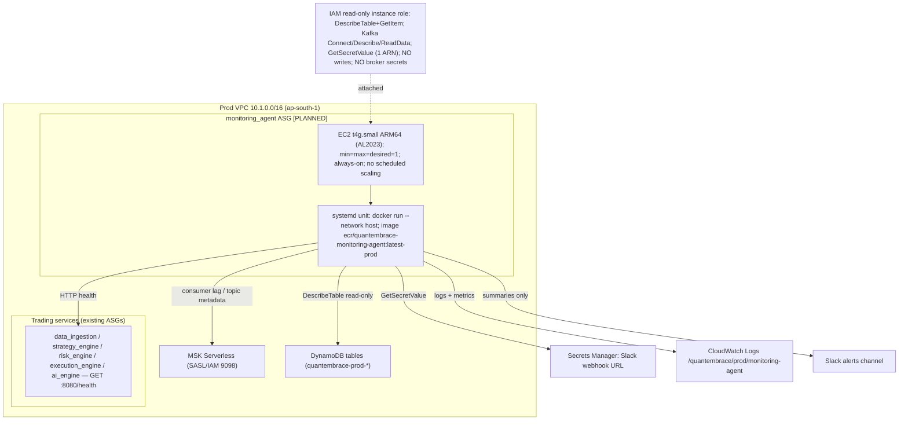
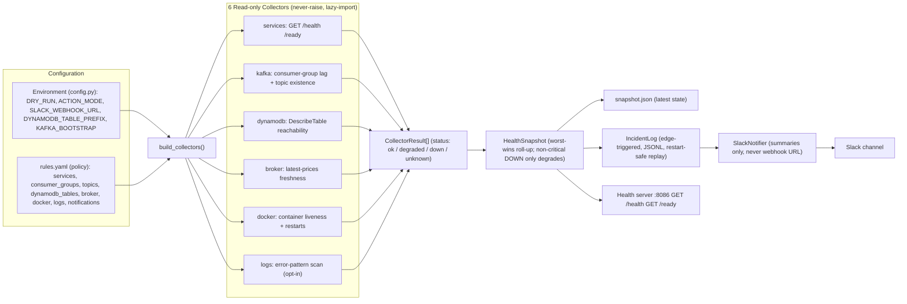
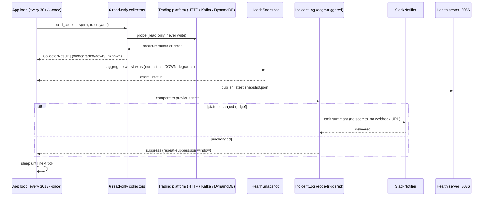
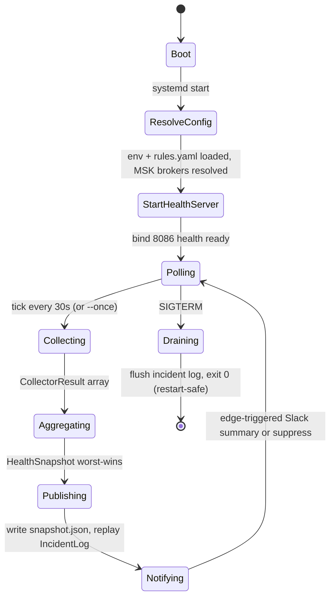

# Monitoring Agent — Deployment Plan & Low-Level Design (LLD)

_Last updated: 2026-05-31 · Owner: Chief Architect · Status: Phase 1 (read-only) shipped; Phase 2 (severity engine) shipped; AWS deployment **[PLANNED — not yet implemented]**_

Companion artifacts:

- **Figma board (4 LLD diagrams):** https://www.figma.com/board/x9PkJyzFAd0bpYO0iO2wAt — Component & Data Flow, AWS Topology [PLANNED], One Poll Cycle (sequence), Process Lifecycle. The Mermaid source for each is embedded inline below; the board mirrors it.
- **Runbook (operator steps):** [`docs/runbooks/monitoring_agent.md`](../runbooks/monitoring_agent.md)
- **Status template (monitoring read-out):** [`docs/operations/monitoring-status-template.md`](../operations/monitoring-status-template.md)
- **Code:** [`services/monitoring_agent/`](../../services/monitoring_agent/) · **Image:** [`infra/deployment/Dockerfile.monitoring_agent`](../../infra/deployment/Dockerfile.monitoring_agent) · **Local wiring:** `docker-compose.yml` service `monitoring_agent`

---

## 1. What this is (and what it is not)

The monitoring agent is a **standalone, read-only sibling observer** of the QuantEmbrace trading fleet. It probes service HTTP health endpoints, reads Kafka consumer-group lag and topic metadata, runs `DescribeTable` + a bounded projection read on DynamoDB, infers broker liveness from `latest-prices` freshness, and (locally) reads Docker container liveness. It assembles a single `HealthSnapshot`, writes it to disk, maintains an edge-triggered incident log, and emits Slack **summaries** on status transitions.

**Phase 1 is strictly observe-only.** There is no code path from a collected status to a trade, an exposure change, a risk override, or the kill switch. This is enforced both by construction (no action layer is wired) and by the mandatory runtime defaults `MONITORING_DRY_RUN=true` and `MONITORING_ACTION_MODE=notify_only`. The agent never writes to the trading platform.

The package already contains empty, self-documenting placeholders for later phases so import paths stay stable:

| Package | Phase | Purpose (planned) |
|---|---|---|
| `detectors/` | **Phase 2 [COMPLETE]** | Consume raw collector `details` (lag, restarts, data age, log error rates) → fine-grained INFO/WARNING/CRITICAL/BLOCKER severities. Additive enrichment only — never changes `overall_status`. See ADR-024. |
| `actions/` | **Phases 3–4 [PLANNED]** | Risk-*reducing* actions only (restart non-critical sidecar; trigger kill switch / pause entries). Gated by `ACTION_MODE` + `DRY_RUN=false`. Never increases exposure. |
| `reports/` | **Phase 5 [PLANNED]** | Roll incident log + snapshots into a daily ops report (Phase 6 adds optional AI summary). |

---

## 2. Where it runs

### 2.1 Local / development — **IMPLEMENTED**

Runs as the `monitoring_agent` service in `docker-compose.yml`, built from `infra/deployment/Dockerfile.monitoring_agent`. It targets the local stack: **Redpanda** (`redpanda:9092`, PLAINTEXT, `KAFKA_USE_IAM=false`) and **LocalStack** (`AWS_ENDPOINT_URL=http://localstack:4566`, `DYNAMODB_TABLE_PREFIX=quantembrace-development`). It binds the Docker socket read-only (`/var/run/docker.sock:ro`) for the container-liveness collector, and depends on the `setup` job completing first. Health/readiness on `:8086`.

### 2.2 AWS production — **[PLANNED — not yet implemented]**

There is **no Terraform for the monitoring agent today** (`grep -r monitoring_agent infra/terraform/` returns nothing). The plan below mirrors the existing EC2 ARM64 ASG pattern in `infra/terraform/modules/ec2_services/` — **EC2/ASG, not Lambda and not ECS Fargate** (Fargate was removed; Lambda is banned for continuous polling).

| Element | Planned choice | Rationale |
|---|---|---|
| Compute | **EC2 `t4g.small` ARM64 (AL2023)**, dedicated ASG `min=max=desired=1`, **always-on** (no scheduled scaling) | Continuous 30s poll loop. A dedicated tiny instance keeps the watcher's blast radius independent of the fleet it watches. |
| AZ | Single instance across the prod 2-subnet set (ap-south-1a/1b); ASG relaunches in either AZ on failure | A singleton observer does not need active-active HA; ASG self-heal is sufficient for Phase 1. |
| Launch model | `systemd` unit → `docker run --network host` pulling `…/quantembrace-monitoring-agent:latest-prod`; userdata clones `bootstrap.sh` + a new `monitoring_agent.sh`, resolves MSK brokers at boot | Identical bootstrap contract to every other service. |
| IAM (instance role) | **Read-only:** DynamoDB `DescribeTable` + bounded projection `Scan`/`GetItem`; Kafka `Connect`/`Describe*`/`ReadData`; `secretsmanager:GetSecretValue` on the **one** Slack-webhook secret ARN. **No writes. No broker-secret (`sessions`) access.** | Least privilege; the agent must be incapable of mutating trading state even if compromised. |
| Kafka | MSK Serverless, **SASL/OAUTHBEARER IAM, port 9098** (`KAFKA_USE_IAM=true`) | Matches the fleet. |
| Secrets | Slack webhook URL in **Secrets Manager** (its own secret), fetched at boot into `/opt/quantembrace/monitoring_agent.env` (chmod 600) | Webhook URL is a secret — never baked into the image, logs, or this doc. |
| Logs/metrics | CloudWatch Logs `/quantembrace/prod/monitoring-agent`; CW Agent for host metrics | Fleet parity. |
| Docker collector | **Disabled on AWS** (`docker.enabled: false`) | No shared Docker socket on a one-container host; rely on the HTTP `services` collector + CloudWatch instead. |

**Required `rules.yaml` change for AWS [PLANNED]:** the `services` block currently points at compose DNS names on ports `8081–8085` (local). On AWS each trading service runs one-per-instance on **`:8080`**, so the agent must target per-instance private IPs (or an internal discovery mechanism) on `:8080`. This is a config change, not a code change.

#### Diagram — AWS Topology [PLANNED]



---

## 3. Low-Level Design (LLD)

### 3.1 Component & data flow

`config.py` (environment + secrets) and `rules.yaml` (policy: which services/groups/topics/tables to watch, thresholds, notification policy) feed `build_collectors()`, which constructs the six read-only collectors. Each collector is **never-raise** (returns `unknown` on any internal failure rather than crashing the loop) and **lazy-imports** its SDK so a missing optional dependency degrades one collector instead of the whole agent. Collectors return `CollectorResult[]` with a coarse `Status` (`ok` / `degraded` / `down` / `unknown`). These roll up **worst-wins** into a `HealthSnapshot` — with the nuance that a **non-critical** component being `down` only pulls the overall status to `degraded`, while a **critical** component `down` makes the overall `down`. The snapshot is published to `snapshot.json` and to the health server; transitions feed the edge-triggered `IncidentLog`, which drives the `SlackNotifier`.



### 3.2 Collector reference (read-only operations)

| Collector | Reads | Status semantics | Critical by default |
|---|---|---|---|
| `services` | `GET /health`, `GET /ready` per service | HTTP 2xx → ok; failure → down/degraded | data/strategy/risk/execution = yes; ai = no (fallback path exists) |
| `kafka` | Committed offsets per consumer group; topic metadata | Phase 1: flags a **missing** critical group / topic; lag thresholds are Phase 2 | `strategy-v1`, `risk-v1`, `execution-v1` = yes |
| `dynamodb` | `DescribeTable` reachability | Reachable → ok; else down | orders/positions/risk-state/strategy-config/latest-prices = yes |
| `broker` | Bounded projection scan of `latest-prices` (`sample_limit: 50`); newest `timestamp` vs `max_age_seconds=60` | Stale during market hours → degraded; **market-hours aware** (suppressed when NSE closed) | inferred — no broker API call |
| `docker` | `list()`/`reload()`/`inspect()` only | Liveness + restart counts | local only; **disabled on AWS** |
| `logs` | Tail-scan files for error patterns (opt-in, `enabled: false` by default) | Pattern hits → degraded | off unless paths configured |

### 3.3 One poll cycle (sequence)



### 3.4 Process lifecycle (restart-safe)

The incident log is JSONL and **replayed on boot**, so a restart re-derives the last known state and does not re-alert on problems that were already open — the agent is restart-safe and idempotent with respect to alerting.



---

## 4. Execution

Two entrypoints run the **identical** Phase 1 read-only loop:

- `python -m monitoring_agent.app` — the dedicated image's `ENTRYPOINT` (primary path).
- `python -m services.monitoring_agent.service` — fleet-parity shim, used when launched via the shared service image.

Both accept `--once` for a single cycle (cron / CI / smoke test) versus the default long-running loop.

The dedicated image (`Dockerfile.monitoring_agent`) is multi-stage on `python:3.11-slim`: it installs `services/requirements.txt` plus the agent's one extra dependency (the Docker SDK), sets `PYTHONPATH=/app:/app/services`, copies the full `services/` tree (the agent imports `shared.health`, `shared.aws.clients`, `shared.kafka.config`, `MarketPhaseGovernor`), runs as a non-root `appuser`, ships a `HEALTHCHECK` against `:8086/health`, and bakes the safety defaults `MONITORING_DRY_RUN=true` + `MONITORING_ACTION_MODE=notify_only`.

### Environment contract

| Variable | Default | Notes |
|---|---|---|
| `MONITORING_DRY_RUN` | `true` | **Mandatory.** Phase 1 must never run with this false. |
| `MONITORING_ACTION_MODE` | `notify_only` | **Mandatory.** No action layer exists to honor any other value in Phase 1. |
| `MONITORING_POLL_INTERVAL_SECONDS` | `30` | Loop cadence. |
| `QE_HEALTH_CHECK_PORT` / `HEALTH_CHECK_PORT` | `8086` | Health/readiness bind port. |
| `KAFKA_BOOTSTRAP_SERVERS` / `KAFKA_USE_IAM` | local: `redpanda:9092` / `false` | AWS: MSK brokers / `true` (resolved at boot). |
| `AWS_ENDPOINT_URL` | local: LocalStack | Absent on AWS (real endpoints). |
| `DYNAMODB_TABLE_PREFIX` | local: `quantembrace-development` | AWS: `quantembrace-prod`. |
| `MONITORING_RULES_PATH` | `…/monitoring_agent/rules.yaml` | Policy file. |
| `MONITORING_SNAPSHOT_PATH` / `MONITORING_INCIDENT_LOG_PATH` | `/app/data/…` | Survive restarts (volume on AWS). |
| `SLACK_WEBHOOK_URL` | unset → log-only | **Secret.** From Secrets Manager on AWS. Never logged. |
| `SLACK_CHANNEL` | `#trading-ops` | Display only. |

---

## 5. Build & release (CI/CD)

Current pipeline (`.github/workflows/`):

- **`build.yml`** — on merge to `main`, builds each *changed* service via `dorny/paths-filter` and pushes `<sha>` (immutable) + `latest-staging` to ECR.
- **`deploy.yml`** — promotes the ECR tag, refreshes the EC2 ASG, runs health checks + staging smoke tests, waits for manual prod approval, then refreshes prod ASGs in risk-safe order (risk → execution → data → strategy, `max-parallel: 1`).

**Gaps to close before AWS deployment of the agent [PLANNED]:**

1. The agent is **absent from both workflows** — `build.yml`'s `paths-filter` and matrix, and `deploy.yml`'s ASG matrices, list only the five trading services. A `monitoring_agent` entry (building from `Dockerfile.monitoring_agent`) must be added.
2. A `monitoring_agent` Terraform module/ASG must be authored under `infra/terraform/modules/` (see §2.2).

---

## 6. Scheduling & daily jobs

### 6.1 The agent is always-on

Unlike the trading services — which the platform scales on market-hours crons — the monitoring agent has **no scheduled scaling**: it must be watching precisely when the fleet scales up, down, or misbehaves. Its `broker` collector is **market-hours aware**, so it suppresses `latest-prices` staleness alerts when NSE is closed rather than being scaled down itself.

For context, the trading-fleet scale schedule (source of truth: `infra/terraform/modules/ec2_services/variables.tf`, cron in **UTC**; IST = UTC + 5:30):

| Event | Cron (UTC) | IST | Days |
|---|---|---|---|
| strategy on | `cron(0 3 ? * MON-FRI *)` | 08:30 | Mon–Fri |
| NSE pre-open scale-up | `cron(15 3 ? * MON-FRI *)` | 08:45 | Mon–Fri |
| NSE post-close scale-down | `cron(45 10 ? * MON-FRI *)` | 16:15 | Mon–Fri |
| US open scale-up | `cron(30 13 ? * MON-FRI *)` | 19:00 | Mon–Fri |
| US close scale-down | `cron(0 1 ? * TUE-SAT *)` | 06:30 (+1d) | Tue–Sat |
| strategy off | `cron(30 1 ? * TUE-SAT *)` | 07:00 (+1d) | Tue–Sat |

The agent runs across **all** of these windows, including the overnight US session, and through the ~07:00–08:30 IST maintenance gap.

### 6.2 Daily operator jobs

The agent is a service, not a batch job — "daily jobs" are the operator's daily touchpoints around it:

1. **Pre-open (~08:30 IST):** confirm the agent is up and overall status is GREEN *before* NSE pre-open. `curl :8086/health` and read the latest snapshot. If the agent itself is down, restart it before relying on session monitoring.
2. **During session:** the agent polls every 30s automatically; watch the Slack channel for transition alerts. No manual action unless an alert fires.
3. **Ad-hoc / CI probe:** run a single cycle with `--once` for a smoke check (e.g. from a scheduled health probe or pipeline step) without leaving a process running.
4. **End of day:** review the incident log for the day's transitions. (Automated EOD rollup is **Phase 5 [PLANNED]** — `reports/`.)

---

## 7. How to start, verify & maintain

### 7.1 Start — local (IMPLEMENTED)

```bash
# Long-running observer alongside the local stack
docker-compose up -d monitoring_agent

# Or a single cycle (no lingering process)
docker-compose run --rm monitoring_agent --once
```

### 7.2 Start — AWS (PLANNED)

Once the module + workflow entries exist (§5): merge to `main` → `build.yml` pushes the agent image → `deploy.yml` promotes the tag and runs an ASG instance refresh. The always-on ASG keeps exactly one instance running.

### 7.3 Verify healthy

```bash
curl -s http://localhost:8086/health     # liveness
curl -s http://localhost:8086/ready       # readiness (first snapshot assembled)
cat /app/data/health_snapshot.json        # latest overall + per-component status
```

Healthy = `/health` and `/ready` both 2xx, overall status `ok`, and all `critical: true` components `ok`. Treat a non-critical `down` (e.g. `ai_engine`) as `degraded`, not an outage — the platform has a fallback path.

### 7.4 Maintain

- **Change what is watched / thresholds:** edit `services/monitoring_agent/rules.yaml` (no secrets there — safe to commit), then redeploy. Remember the AWS `:8080` endpoint change in §2.2.
- **Rotate the Slack webhook:** update the Secrets Manager secret; the value flows in at next boot — never edit the image or commit the URL.
- **Patch / roll the instance (AWS):** ASG instance refresh (same mechanism as the fleet).
- **Inspect history:** the incident log (`monitoring_incidents.jsonl`) is append-only JSONL and replayed on boot.
- **Troubleshooting:** see [`docs/runbooks/monitoring_agent.md`](../runbooks/monitoring_agent.md).

---

## 8. Cost optimization notes (Chief-Architect view)

- **No Lambda, no Fargate.** A 24/7 30-second poll loop is exactly the continuous workload the cost rules say to keep off Lambda; Fargate was removed fleet-wide. An always-on **`t4g.small` ARM64** (~₹/$ low-double-digits per month on-demand, less under a Savings Plan / RI) is the cheapest correct fit.
- **Single instance, single watcher.** `min=max=desired=1`. No multi-AZ active-active for a Phase-1 observer; ASG self-heal covers instance/AZ loss.
- **Dedicated vs. co-located — deliberate trade-off.** Co-locating the agent on an existing non-critical instance would save the ~one-instance cost, but couples the watcher's fate to a watched host. For a monitor, **independence wins**; the spend is marginal. Revisit only if instance count becomes a cost driver.
- **Read-only, low-RCU.** DynamoDB access is `DescribeTable` + a bounded `sample_limit: 50` projection scan — negligible RCU. Kafka access is metadata/offsets only. Minimal data-transfer footprint.

---

## 9. Known discrepancies (flagged, not fixed)

Per the project rule "one fix per PR, no opportunistic refactors," these are surfaced here for separate, deliberate PRs rather than changed as a side effect of this document:

| # | Finding | Evidence | Impact |
|---|---|---|---|
| 1 | `deploy.sh` is legacy ECS | `infra/deployment/deploy.sh` calls `aws ecs update-service` and links the ECS console | Contradicts the EC2 ASG deployment model; misleading if run. |
| 2 | `deploy.yml` references missing scripts | `scripts/deploy/refresh_asg.sh` and `check_asg_health.py` are **absent**; only `check_ecs_health.py` (also stale) + `promote_ecr_image.sh` exist | The prod deploy workflow would fail at the refresh/health steps. |
| 3 | Monitoring-module alarms use ECS namespace | `infra/terraform/modules/monitoring/main.tf` alarms reference `AWS/ECS` | Alarms won't fire against EC2 ASG metrics. |

These are pre-existing and independent of the agent; none block Phase 1, but #1 and #2 must be resolved before the agent (or any service) can deploy to AWS cleanly.

---

## 10. Open tasks & next steps

1. **[PLANNED]** Author `infra/terraform/modules/monitoring_agent/` (launch template + always-on ASG + read-only IAM role/policy + CloudWatch log group + Secrets Manager wiring), mirroring `ec2_services`.
2. **[PLANNED]** Add `monitoring_agent` to `build.yml` (paths-filter + matrix) and `deploy.yml` (its own always-on refresh step).
3. **[PLANNED]** Add an AWS `rules.yaml` profile pointing the `services` collector at `:8080` per-instance and setting `docker.enabled: false`.
4. **[separate PR]** Resolve discrepancies §9 (#1, #2, #3).
5. **Then — Phase 2:** implement `detectors/` (severity engine: INFO/WARNING/CRITICAL/BLOCKER) consuming the lag/staleness/restart thresholds already parsed in `rules.py`. **Deferred until this document is approved.**

---

_Diagrams authored in Figma via the connected board above; Mermaid source is embedded inline so this document renders standalone (GitHub) and round-trips back into FigJam._
